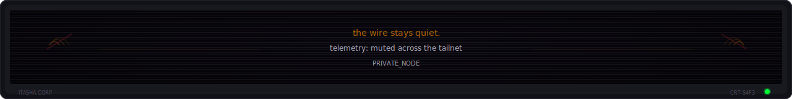

<p align="center">
  <picture>
    <source media="(prefers-color-scheme: dark)" srcset=".github/assets/header.svg" />
    <source media="(prefers-color-scheme: light)" srcset=".github/assets/header.svg" />
    
  </picture>
</p>

<p align="center">
  <b>Mutes phone-home traffic from the Tailscale Windows client. The wire stays quiet.</b>
</p>

<p align="center">
  <a href="#what-it-does">Overview</a> &nbsp;&middot;&nbsp;
  <a href="#what-gets-blocked-where">Layers</a> &nbsp;&middot;&nbsp;
  <a href="#install">Install</a> &nbsp;&middot;&nbsp;
  <a href="#daily-use">Daily use</a> &nbsp;&middot;&nbsp;
  <a href="#verify-its-working">Verify</a> &nbsp;&middot;&nbsp;
  <a href="#uninstall">Uninstall</a>
</p>

<p align="center">
  <a href="https://github.com/46b-ETYKiAL/Itasha.Corp_S4F3-MUT3/actions/workflows/ci.yml"></a>
  
  
  
  
  <a href="LICENSE"></a>
</p>

## About

Part of the Itasha Corp toolkit. The Wired carries everything; you don't have to feed it. This kit closes the upload pipe to `log.tailscale.io` on Windows and routes any other device on your tailnet through a local DNS sinkhole so the silence holds for the phone in your pocket too. Three layers, defense in depth — the operator prefers belts and suspenders. Set it once; the wire goes quiet on its own.

---

## What it does

A self-contained PowerShell kit that:

1. **Stops your Tailscale Windows client from uploading debug logs** to `log.tailscale.io` (the behavior F-Droid flags as the *NonFreeNet* anti-feature on the Android client).
2. **Installs AdGuard Home as a local DNS sinkhole** so any other devices on your tailnet (typically: your phone) get the same block via tailnet-wide DNS.
3. **Wires lifecycle via a Windows service dependency**: AdGuardHome lists Tailscale as a required service, so Windows cascade-stops AdGuardHome whenever Tailscale stops, and `Start-Service AdGuardHome` auto-starts Tailscale first. Neither service auto-starts at boot.
4. **Adds Start Menu shortcuts** that point at `scripts/start.ps1` and `scripts/stop.ps1` — both self-elevate via UAC and explicitly transition both services with verification output.

The end state is **defense in depth**: even if one layer fails, the others still block telemetry uploads.

---

## What gets blocked, where

| Layer | Where it runs | What it blocks |
|---|---|---|
| `TS_NO_LOGS_NO_SUPPORT=true` env var | This Windows PC | Tailscale client refuses to attempt log uploads at all |
| Hosts file `0.0.0.0 log.tailscale.io` | This Windows PC | OS resolves `log.tailscale.io` to `0.0.0.0` for any local app |
| AdGuard Home DNS rule `\|\|log.tailscale.io^` | This PC, but listening on the tailnet IP | Any device on your tailnet (phone, etc.) gets NXDOMAIN |

---

## Why all three layers

Couldn't I just use AdGuard Home alone? Two reasons no:

1. **Tailscale on Windows installs a WFP (Windows Filtering Platform) driver that prevents local user processes from reaching anything on UDP/53**, including a local DNS server. So this PC's own apps cannot be routed through AdGuard Home — they have to hit the hosts file directly. That's why `tailscale set --accept-dns=false` is part of the setup: it stops Tailscale from forcing DNS through the (unreachable, from this PC) AdGuard.
2. **Telemetry should be killed at source on the Tailscale client itself.** The `TS_NO_LOGS_NO_SUPPORT=true` env var is the official Tailscale knob for this. The downside (Tailscale's policy: "no logs, no support") is acceptable for users who'd rather not phone home.

The phone, however, *can* reach AdGuard Home via the tailnet's WireGuard tunnel — those queries arrive on the Tailscale virtual NIC as inbound traffic and bypass the WFP filter entirely.

---

## Requirements

- Windows 10 / 11
- PowerShell 5.1+ (ships with Windows; PowerShell 7 also works)
- [Tailscale for Windows](https://pkgs.tailscale.com/stable/) installed
- Admin rights on this PC
- A Tailscale tailnet you own (free tier is fine)
- An Android device with the [F-Droid Tailscale build](https://f-droid.org/packages/com.tailscale.ipn/) or the official client

---

## Install

```powershell
# Clone the repo, cd into it
git clone https://github.com/46b-ETYKiAL/Itasha.Corp_S4F3-MUT3.git
cd Itasha.Corp_S4F3-MUT3

# Run setup (will self-elevate via UAC)
.\setup.bat        # or: powershell -ExecutionPolicy Bypass -File scripts\setup.ps1
```

Two manual web-UI steps remain after the script finishes — the script can't drive these for you:

### 1. AdGuard Home first-run wizard

Open <http://localhost:3000> in any browser. Walk through the wizard:

| Wizard screen | What to set |
|---|---|
| Admin Web Interface | Listen on **All interfaces**, port **3000** |
| DNS server | Listen on **All interfaces**, port **53** |
| Authentication | Pick a username + strong password |

After signing in, **Filters → Custom filtering rules** should already contain `||log.tailscale.io^` (inserted by `setup.ps1`).

### 2. Tailscale admin console DNS

Go to <https://login.tailscale.com/admin/dns>:

1. **Nameservers → Add nameserver → Custom** → IP: *your machine's tailnet IPv4* (run `tailscale ip -4` to see it; the setup script prints it for you at the end). Save.
2. Toggle **Override DNS servers** ON.
3. Toggle **MagicDNS** ON (if not already).
4. Optional but recommended: edit the new nameserver entry and toggle **Use with exit node** so blocking still works while a Mullvad/exit-node is active.

On Android: open the Tailscale app, toggle off then on once. The phone now uses your AdGuard for DNS resolution via the tailnet.

---

## Daily use

Both services are set to **Manual** start. Nothing runs at boot.

| Action | How |
|---|---|
| Start everything | Press Win, type "Tailscale", click **Start Tailscale + AdGuard** |
| Stop everything | Win, type "Tailscale", click **Stop Tailscale + AdGuard** |
| Status check | Run `powershell -ExecutionPolicy Bypass -File scripts\status.ps1` in the repo dir (no admin required for most checks) |

Single UAC prompt per click. The Start shortcut runs `scripts\start.ps1` which self-elevates and brings up Tailscale then AdGuardHome explicitly. The Stop shortcut runs `scripts\stop.ps1` which stops AdGuardHome then Tailscale. Even if a script fails partway through, the service dependency wired by `setup.ps1` (`sc.exe config AdGuardHome depend= Tailscale`) guarantees that stopping Tailscale by any means cascades a clean stop to AdGuardHome.

> The **Tailscale tray's "Exit"** option only closes the UI — the service keeps running. To actually stop the service (and cascade-stop AdGuard), use the Stop shortcut, or `net stop Tailscale` in an elevated shell.

---

## Verify it's working

### From this Windows PC

```powershell
Resolve-DnsName log.tailscale.io
# Expected: log.tailscale.io  A  0.0.0.0    (from the hosts file)
```

### From your phone (with Tailscale connected)

Three options, easiest first:

1. **Open `log.tailscale.io` in Chrome.** Should fail with `ERR_NAME_NOT_RESOLVED` or "site can't be reached".
2. **AdGuard query log** at `http://<your-tailnet-ip>:3000` → Query log. Filter by your phone's tailnet IP. Queries to `log.tailscale.io` should appear marked **Blocked by custom filtering rules**.
3. **NetX or DNS Lookup** (both open-source, on F-Droid). Query `log.tailscale.io` → expect `0.0.0.0` or NXDOMAIN.

---

## What this kit does NOT do

- **Doesn't make AdGuard a 24/7 service.** AdGuard runs only while Tailscale runs, and only on this Windows PC. If the PC is off/asleep, your phone has no tailnet DNS and falls back to whatever the local network gives it (which won't block `log.tailscale.io`). For an always-on setup, run AdGuard on a Pi, NAS, or VPS instead — that host won't hit the Windows WFP issue either.
- **Doesn't intercept traffic on `log.tailscale.io` from your phone if the phone isn't connected to the tailnet.** Tailscale-off → DNS goes through carrier/Wi-Fi DNS → no block.
- **Doesn't block other Tailscale endpoints** (login.tailscale.com, controlplane.tailscale.com). Those are required for Tailscale to function. Blocking them breaks the tunnel.

---

## Uninstall

```powershell
.\uninstall.bat    # or: powershell -ExecutionPolicy Bypass -File scripts\uninstall.ps1
```

Reverts every change `setup.ps1` made (services, scheduled tasks, firewall rules, hosts file, Start Menu shortcuts, AdGuard install dir, Tailscale env file). One manual step remains in the Tailscale admin console (remove the custom nameserver, turn off Override DNS).

---

## Files

| File | Purpose |
|---|---|
| `scripts/setup.ps1` | Idempotent installer — safe to re-run |
| `scripts/uninstall.ps1` | Reverses `setup.ps1` |
| `scripts/start.ps1` | Self-elevating: starts Tailscale + AdGuardHome with verification |
| `scripts/stop.ps1` | Self-elevating: stops both services in reverse dependency order |
| `scripts/status.ps1` | Read-only diagnostic — services, dependency, files, hosts, firewall, web UI |
| `setup.bat` / `start.bat` / `stop.bat` / `status.bat` / `uninstall.bat` | Double-click wrappers for the corresponding `.ps1` (handy because Windows opens `.ps1` in Notepad on double-click by default) |
| `README.md` | This file |

### Three ways to invoke

1. **Start Menu** (created by `scripts/setup.ps1`): Press Win, type "Tailscale", click *Start Tailscale + AdGuard* / *Stop Tailscale + AdGuard*.
2. **Double-click a `.bat`** at the repo root: `setup.bat`, `start.bat`, `stop.bat`, `status.bat`, `uninstall.bat`. The `.bat` calls the matching `.ps1` under `scripts/`; setup/start/stop/uninstall self-elevate via UAC; `status.bat` runs read-only and pauses so you can read the output.
3. **Direct PowerShell**: `powershell -ExecutionPolicy Bypass -File <repo>\scripts\start.ps1` — useful when you want to pipe `-NoPause` for scripting.

---

## Trade-offs and caveats

- **`TS_NO_LOGS_NO_SUPPORT=true` carries a "no logs, no support" policy from Tailscale.** If you ever file a bug with them, you'll need to remove the env file and restart the service before they'll help.
- **AdGuard Home version is pinned** in `setup.ps1` (currently v0.107.74) with a known SHA256. Update both fields when bumping versions.
- **The kit assumes one tailnet node running AdGuard.** Multi-node redundancy isn't covered — that's a different setup.
- **Tailscale's MagicDNS still answers tailnet-internal names** (`*.ts.net`) via 100.100.100.100, regardless of the global nameserver. That's by design and not a problem for log blocking.

---

## License

MIT. Do whatever you want.

---

## Keywords

Tailscale telemetry blocker · Tailscale phone-home blocker · disable Tailscale logs Windows · `TS_NO_LOGS_NO_SUPPORT` · NonFreeNet F-Droid Tailscale · log.tailscale.io block · AdGuard Home tailnet DNS · tailnet-wide DNS sinkhole · WireGuard privacy hardening · Tailscale telemetry mute · Windows AdGuard Home installer · Tailscale Android telemetry block · Tailscale privacy kit Windows.

---

*S4F3-MUT3 is part of the Itasha Corp toolkit.*

<p align="center">
  <picture>
    <source media="(prefers-color-scheme: dark)" srcset=".github/assets/footer.svg" />
    <source media="(prefers-color-scheme: light)" srcset=".github/assets/footer.svg" />
    
  </picture>
</p>
